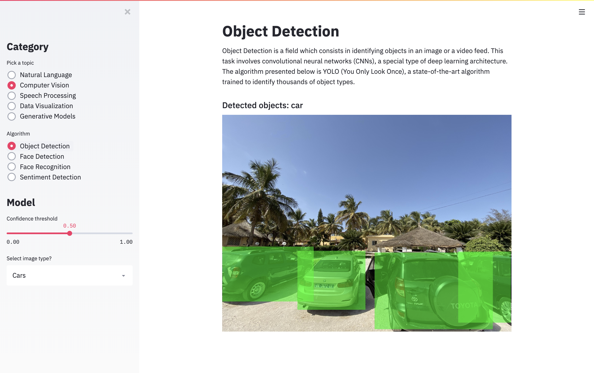
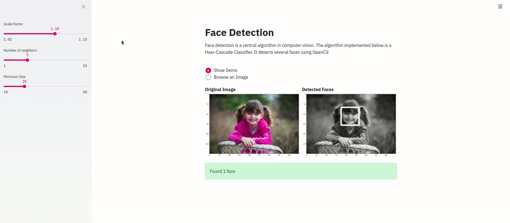
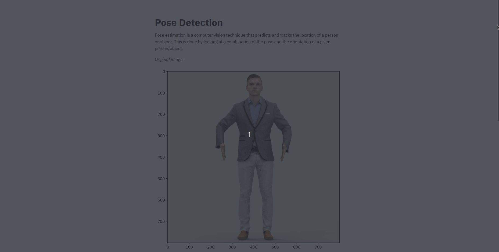
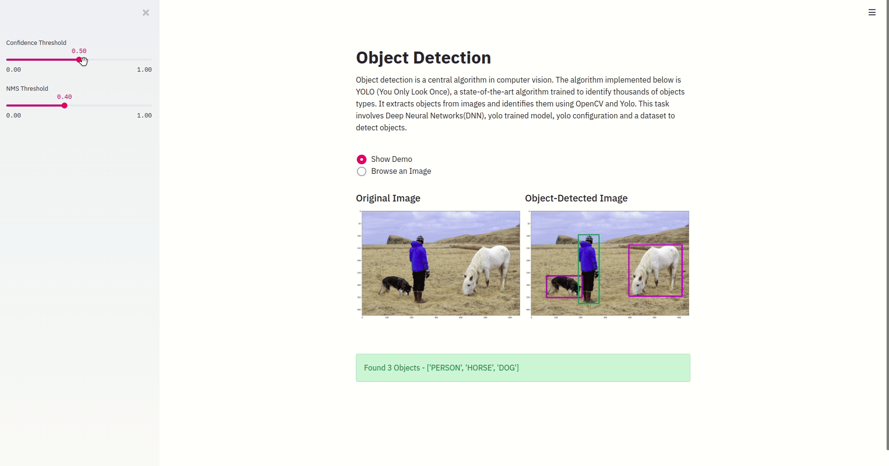
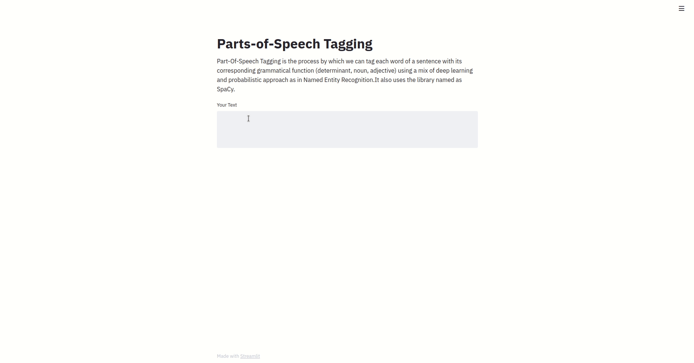
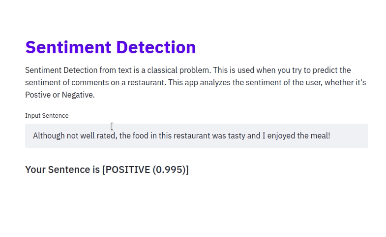

# StreamAI

In this app, We'll be deploying NLP, Computer Vision, Speech Processing and Data science Models in a single application on Streamlit. 

## What's inside?

The idea is to leverage *pre-trained* models as well as algorithm built on my side. It's a good opportunity for me to become more familiar with all pre-trained models available in the open-source community. 

The algorithms covered are:
- Natural Language Processing
	- Part-Of-Speech Tagging with `SpaCy`
	- Named Entity Recognition with `SpaCy`
	- Sentiment Classification with `Flair`
	- Question Answering with `AllenNLP`
- Computer Vision
	- Object Detection with `Yolov3`
	- Face Detection with `Haar Cascade Classifier`
	- Eyes Detection with `Haar Cascade Classifier`
	- Smile Detection with `Haar Cascade Classifier`
	- Image Contrasting using `OpenCV`
	- Cannize with `Haar Cascade Classifier`
	- Cartoonize with `Haar Cascade Classifier`
	- Style Detection
	- Semantic Segmentation 
	- Pose Detection
- Speech Processing
	- Voice Based Gender Identification
- Data Visualization
	- DataSet Explorer for Exploratory Data Analysis using `Pandas Profiling` and `Sweetviz`


I integrate and deploy everything using Streamlit and Render.com. 

## How to use it?

The application looks like this:



If you would like to contribute, feel free to submit a PR.

To run it locally, clone this project and run :

```bash
pip install -r requirements.txt
```

Run the app:

```bash
streamlit run app.py
```

## Functionalities of the app:
The application covers various domains of AI like NLP, Computer Vision, Speech Processing, Data Visualisation and Generative Models. Below are the snapshots depicting the functioning of various algorithms under each domain.

### 1. Computer Vision
Computer vision is a field of study that deals with how computers can gain high-level understanding from digital images or videos. Under this, we have covered following algorithms:

#### (a) Face Detection-
A central algorithm in computer vision responsible for detecting several faces using Open-CV and Haar-Cascade Classifier. 


#### (b) Smile Detection-
A smile detector built using OpenCV browses an image and detects the smiles. Haar-cascades classifiers have been used which detect smile by superimposing predefined patterns over face segments and are used as XML files. 


#### (c) Eyes Detection-
The algorithm in computer vision is used for detecting eyes in an image using Open-CV and Haar-Cascade Classifier. 


#### (d) Pose Detection-
This algorithm is used to infer the pose of a person in an image by identifying, locating, and tracking a number of keypoints on a given person. These key points represent major joints like an elbow or knee. 	


#### (e) Object Detection-
As the name suggests, this algorithm extracts objects from an image and identify them. This task involves the use of YOLOv3 (You Only Look Once-Version 3), a pre-trained model. YOLO is a state-of-the-art algorithm trained to identify thousands of objects types with great accuracy. 


### 2. Natural Language Processing
A technique to translate natural language into a format understandable by computers in order to process huge amount of data intelligently to yield the useful information. Under this, we have covered following algorithms:
#### (a) Part-Of-Speech Tagging 
This algorithm is intended for assigning parts of speech (such as NOUN, ADJECTIVE, CONJUNCTION etc.) to individual words in a provided sentence. `SpaCy`, which provides a default model to recognise correct parts-of-speech tags from a text depending upon the context, has been used to implement this.


#### (b) Named Entity Recognition
This algorithm is responsible for classifying entities in a provided sentence into predefined categories such as person, date, time, location, organization, percentage etc. This has been trained using a pre-trained model -`SpaCy` which is known to be the fastest NLP framework in Python. we have focused on ***`spacy_streamlit.visualize_ner()`*** to visualize the Named Entities using spaCy model.


#### (c) Sentiment Analysis
Sentiment Analysis from a text is a classical problem of NLP. This algorithm is a text analysis technique that detects the sentiment of the user, whether it's positive or negative.


#### (d) Question Answering
This algorithm is intended to build systems that automatically answer questions posed by humans in a natural language. You write a query regarding a long input text, the algorithm goes through the text and identifies the region of the text which is the most likely to contain the answer.
